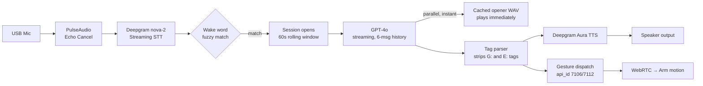
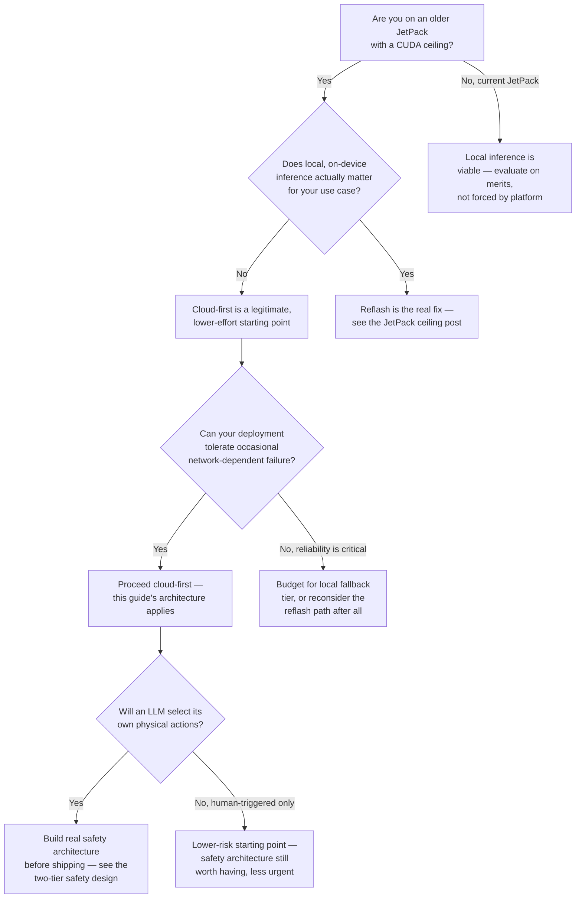

This is the guide we wish existed before we started. If you're building conversational, gesture-capable behavior on a Unitree G1 EDU — or any embedded robotics platform stuck on an older JetPack/CUDA version — and you're deciding whether a cloud-first stack makes sense, this walks through the real architecture, the real latency numbers, what actually worked, and where the hard edges are.

{/* truncate */}

## Who this is for, and the core bet

If your platform is on JetPack 5.1.1 (CUDA 11.4, Python 3.8), you already know the ceiling: modern local-LLM tooling and current STT/TTS libraries mostly assume newer CUDA and Python than that platform provides (see [the hard-ceiling post](/blog/jetpack-5-1-1-hard-ceiling) for the full technical reasoning). You have two real options: reflash to a newer JetPack, or go cloud-first and sidestep the ceiling entirely (see [the companion escape-hatch post](/blog/cloud-llm-escape-hatch) for that tradeoff in full).

This guide covers the second path — a cloud-first stack that ran, in production, on stock JetPack 5.1.1, no reflash required. The core bet: a hosted STT engine, a hosted LLM, and a hosted TTS engine, orchestrated by a Jetson that does no heavy inference itself at all — just capture, routing, and playback.

## The full pipeline

Each stage is covered in full technical detail in [the voice-to-action pipeline post](/blog/voice-to-action-pipeline-brewbert-era) — this guide focuses on the numbers and the decisions, not re-explaining each stage from scratch.

## The real latency budget: ~2.5 seconds of work, ~1 second perceived

This is the number worth internalizing before you start: **the actual end-to-end pipeline takes roughly 2.5 seconds from wake word to spoken response.** That's not a failure — cloud STT, a frontier LLM call, and cloud TTS synthesis genuinely take real time, and no amount of client-side optimization changes the physics of three sequential network round-trips to hosted services.

What actually matters is that **the perceived latency is closer to 1 second**, and that gap is closed by a specific, deliberate trick, not a speed improvement:

```mermaid
gantt
    title Real work vs. perceived experience
    dateFormat X
    axisFormat %S.%Ls

    section Real Pipeline
    Wake word detected           :milestone, m1, 0, 0ms
    STT finalizes utterance      :active, stt, 0, 400ms
    GPT-4o time-to-first-token   :active, llm, 400, 1200ms
    GPT-4o full response streams :active, llmfull, 1600, 2200ms
    TTS synthesizes response     :active, tts, 2200, 2700ms
    Response audio plays         :crit, respaudio, 2700, 3500ms

    section Perceived Experience
    Opener WAV plays instantly   :done, opener, 0, 900ms
    Silence gap (masked)         :active, gap, 900, 2700ms
    Real response takes over     :crit, real2, 2700, 3500ms
```

The mechanism: the instant a wake word fires, a **pre-rendered opener WAV** ("Oh, hello!") plays immediately, on a separate thread, in parallel with the real pipeline doing its actual work underneath. By the time that short opener finishes, the real response has usually arrived. The person experiences a robot that responded almost instantly — the actual 2.5-second pipeline never stopped running, it just wasn't the thing they were listening to.

**This is worth being honest about:** it's a genuine UX trick, not a technical optimization. If you're building something similar, budget your actual pipeline at 2-3 seconds realistically, and plan your latency-masking strategy as a first-class design decision, not an afterthought bolted on after the fact.

## What actually worked, and why

- **Fuzzy wake-word matching**, not exact string matching — real STT output reliably mishears wake words, and a `difflib`-based fuzzy match with an explicit list of known mishearings caught far more real attempts than exact matching ever would.
- **The model choosing its own gestures and emotional tags**, embedded directly in its own text output (`[G:id]`, `[E:tag]`) — this is what made the interaction feel genuinely alive rather than scripted, and it's a capability worth taking seriously if you want a character that feels responsive rather than robotic.
- **A cleanly layered audio-output stage** — swapping the final output hardware (external speaker to onboard speaker) required touching nothing upstream of that one stage. If you're designing something similar, keep your output stage as replaceable as this one was; it's a good sign the rest of the architecture is properly decoupled.
- **Session-aware word-count gating** — different trigger thresholds inside vs. outside an active conversation session meant far less accidental triggering from ambient background speech, without needing a heavier, more complex intent-classification layer.

## Where the hard edges are

This stack has real, documented limits worth knowing before you commit to it:

- **WebRTC as a gesture-control transport is genuinely fragile against vendor firmware updates**, entirely outside your control — see [the full WebRTC saga](/blog/webrtc-saga-april-demo-to-armsdk) for exactly how badly this can go, and how long a fix can take even with an active, engaged community maintainer.
- **Only one active WebRTC session at a time** — the vendor app and your own client cannot both be connected; plan your operational workflow (close the app before connecting) around this constraint explicitly, not as a surprise you discover live.
- **An LLM selecting its own physical actions is a real, physical-world risk surface**, not just a conversational one — [the Frankenstein incident](/blog/voice-to-action-pipeline-brewbert-era#where-autonomy-went-further-than-intended) is the concrete example: two commands the model fired close together put the robot into a genuine lockup. If you give a model this kind of autonomy, plan real safety architecture around it from day one — see [the two-tier safety design](/docs/log/safety-reliability/safe-idle-two-tier-safety) for the shape that took here.
- **A cloud-dependent architecture makes network loss a real, severe failure mode** — see [the demo-crash misdiagnosis](/docs/log/safety-reliability/crash-not-wifi) for a case where this was initially (wrongly) assumed to be the cause of a failure that turned out to be something else — but the fact that it was a *plausible* wrong guess tells you how real a risk this actually is.

## Decision framework, if you're starting fresh

## The honest tradeoffs, one more time

This isn't the objectively correct architecture — it's the right one for a specific set of constraints: no reflash tolerance, acceptable network dependency, and a real budget for handling the physical-safety implications of model-driven autonomy. If your constraints are different — strict data-privacy requirements, zero tolerance for network-dependent failure, or a platform where the reflash is cheap and low-risk — a different starting point is genuinely more correct for you, not just a matter of preference.

What we'd tell anyone starting this exact path: budget the real 2.5-second pipeline honestly, design your latency-masking strategy deliberately rather than as an afterthought, and build your safety architecture *before* you give a model the ability to act in the physical world — not after the first incident makes it obvious you needed to.
