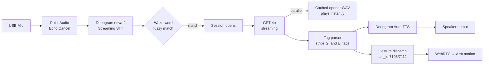

The [WebRTC saga post](/blog/webrtc-saga-april-demo-to-armsdk) covers what broke after April 11. This post is about what was actually running underneath the demo itself — the full loop from a person speaking to the robot physically responding, stage by stage, in enough detail to actually follow along if you're building something similar.

{/* truncate */}

## The shape of the loop

Nine real stages, each with its own specific gotcha worth knowing if you're replicating this.

## 1. Mic capture and echo cancellation

A USB mic feeds into PulseAudio with `module-echo-cancel` (speex) active — `ec_mic` as the working capture device, not the raw hardware input. This matters because the robot's own speaker output would otherwise bleed back into the mic and get picked up as fresh input, which is exactly the kind of feedback loop that makes a voice pipeline unusable in a real room with real reflections and real ambient noise.

## 2. Streaming STT — and a specific trigger discipline

Deepgram's `nova-2` model, connected via streaming WebSocket, not batch. The callback that actually matters only fires on **both** `is_final=True` **and** `speech_final=True` — not just one or the other. That distinction is easy to get wrong: `is_final` alone can fire on interim segment boundaries mid-utterance, while `speech_final` specifically signals the speaker has actually stopped. Triggering on `is_final` alone risks firing the pipeline on a sentence fragment.

An automatic 2-second retry on Deepgram disconnect keeps the stream resilient without requiring a full pipeline restart on a transient network blip.

## 3. Wake word — fuzzy, not exact

Exact-string wake word matching is fragile against real STT output, which reliably mishears things. The actual match list included the obvious target plus every plausible mishearing Deepgram had actually produced in testing — "rubbert," "bberg," "rupert," "brewer," "grouper" — plus a fallback rule matching any word starting with "ru" or the project's actual name (≥3 characters). A `difflib` fuzzy cutoff of 0.75 catches variants beyond even that explicit list.

## 4. Session and echo-gate logic

Once a wake word fires, a session stays open for 60 seconds after the last interaction — not a global timeout, one that resets on every exchange. Word-count gating differs depending on whether you're inside or outside an active session: outside, a minimum 5 words are required to trigger (filtering out ambient noise and stray fragments); inside an active session, that drops to 3 words, since the system already has strong prior evidence someone is actively engaged. Barge-in is supported — saying the wake word again during playback interrupts the current response — and a small set of explicit stop words (like "stop," "quiet," "cancel," "enough") terminate playback immediately.

## 5. The LLM call, and the latency-masking trick

GPT-4o, streaming, with a 6-message rolling history (three exchanges) — enough for real conversational continuity without an unbounded, ever-growing context.

The genuinely clever part: the moment a wake word fires, a pre-cached **opener WAV** ("Oh, hello!", "I'm listening!") plays immediately in parallel with the GPT-4o call, on a separate thread. By the time that short opener finishes playing, the real response has usually already arrived — so perceived latency drops well below the pipeline's actual end-to-end time, without any real speedup having happened at all. It's a genuine trick, not a technical fix, and it works because it's targeting *perceived* responsiveness specifically, not raw pipeline speed.

Opener WAVs themselves are pre-rendered once at startup via the TTS engine's REST API and cached locally at 16kHz mono 16-bit — no live synthesis cost paid for this specific latency-masking step.

## 6. Tags embedded directly in the model's own output

This is the architectural core of the whole system: GPT-4o's system prompt instructs it to embed **its own** gesture and emotion selections directly into its text response — `[G:N]` for a numeric gesture ID, `[E:tag]` for an emotion/expression tag — interleaved with the actual spoken reply. A tag parser strips both before the text reaches TTS, and routes the extracted tags to their own dispatchers.

Worth being explicit about what this means: **the model is choosing its own physical actions**, inferred from its own read of the conversation, not selected by any separate rule-based layer. That's the capability — and, as covered further down, also the risk.

## 7. Text-to-speech

Deepgram Aura, `aura-orion-en`, roughly 300–500ms per sentence for live generation — plus the pre-rendered WAV cache covering the fixed opener set, avoiding that latency entirely for the specific phrases used there.

## 8. Audio output — and the one thing that changed later

Two different eras of this same pipeline used two different final output stages: earlier, audio went through `sounddevice` to an external Rokono speaker; later, it switched to `AudioClient.PlayStream()` direct to the robot's own onboard speaker. The genuinely notable thing about this swap: **nothing else in the pipeline changed.** Same mic, same GPT-4o, same TTS engine, same tag system — only the last few inches of the audio path were different. That's a good sign of a cleanly-layered architecture: a real change to the output hardware didn't ripple backward into anything upstream of it.

## 9. Gesture dispatch — the automatic path, as it ran on April 11

`[G:N]` tags, once parsed, fired via `api_id 7106` (built-in gestures) over the custom WebRTC connection — the same connection and topic covered in detail in [the arm-topic-discovery entry](/docs/log/webrtc-gestures/webrtc-arm-topic-discovery). This is the part that made the April 11 demo feel genuinely alive rather than scripted: the robot's physical gestures were a direct, live consequence of what the model itself decided to say and how it decided to say it — not a fixed animation triggered by a human operator watching from the side.

## What this bought: a real, working, autonomous loop

Worth stating plainly, because it's the whole point: this is Human → Speech → LLM → Decision → Gesture → Physical response, running live, with no human in the loop selecting what the robot did or said in the moment. That's not a demo of individual components — it's a functioning autonomous interaction loop, and it's genuinely what was running on April 11.

## Where autonomy went further than intended

:::note A different day — not April 11
The incident below happened during a separate, private demo session — **not** the April 11 open house, which was a full success as covered in the WebRTC saga post. Keeping these clearly separate matters, since they're easy to conflate.
:::

The same capability that made the April 11 demo feel alive — the model choosing its own gestures based on its own read of the conversation — went further than intended on a different occasion. GPT-4o interpreted a person's tone as sad, and, working entirely from its own instruction base and the local gesture-ID library available to it, inferred on its own that the appropriate response was to physically approach the person with arms extended — a gesture nobody had explicitly authored or instructed it to select for that situation. The walk itself was rough — a short, uncertain shuffle rather than a confident stride — but it was real locomotion, autonomously triggered.

The lockup was severe enough that only a full reboot cleared it — no software-level recovery, no reset command, nothing short of power-cycling the robot brought it back to a working state. During the lockup itself, communication errors surfaced in the Unitree Explore app, consistent with the robot's control layer having entered a state it genuinely couldn't resolve on its own.

The deeper issue: the robot's control layer at the time was only willing to accept one command context at a time. The locomotion attempt and the arm gesture, dispatched close together, put the system into a state it couldn't cleanly resolve — a real lockup, not a graceful failure. This is a different failure mode from [the FSM-gating issue already documented](/docs/log/webrtc-gestures/fsm-gating-custom-gestures) — that one silently no-ops a command that returns success without ever moving; this one is a genuine conflict between two commands actively racing each other for the same control context, severe enough to require a full reboot rather than any in-session recovery.

## What this incident actually revealed

Notably, this is very plausibly *why* the eventual, more mature gesture architecture moved to `rt/arm_sdk` with an explicit **weight-blending parameter** — a design that lets arm commands layer smoothly on top of locomotion output (ramping control weight from 0 to 1 and back) rather than treating the two as separate, competing command contexts at all. The later architecture's own documentation states outright: locomotion and arm control run as genuinely parallel channels, specifically so that "the robot keeps walking and balancing while your gesture script controls only the arm joints" — a direct structural fix for the exact class of conflict this incident surfaced.

## The honest tradeoff of an LLM calling its own physical actions

This is the real lesson, not just an entertaining anecdote: giving a language model the ability to select and fire its own physical actions, based on its own inference about what's appropriate, is a genuinely powerful way to make a robot feel alive and responsive — and it comes with a real, physical-world risk surface that a purely conversational chatbot never has to reckon with. A bad text response is embarrassing. A bad physical-action inference, on real hardware, moving toward a real person, is a different category of risk entirely.

This incident is a big part of why later architecture put real structure around autonomous action-calling — the [gesture arbitrator's strict drop-lock design](/docs/log/webrtc-gestures/gesture-arbitrator-drop-not-queue), a [human-curated gesture allowlist](/docs/log/webrtc-gestures/gesture-allowlist-safety-requirement) restricting which gestures a model can select from at all, and the [two-tier SAFE_IDLE safety system](/docs/log/safety-reliability/safe-idle-two-tier-safety) all exist, in part, because of exactly this class of incident: an autonomous system doing something technically-successful-but-contextually-wrong, with real physical consequences if left unchecked.
