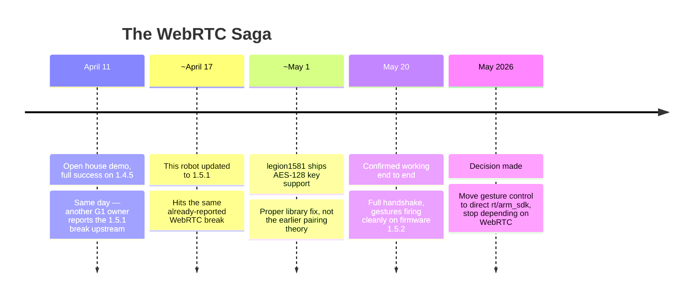

On April 11, 2026, the first real demo of Project Ziko ran at an open house — voice pipeline working end to end, wake word firing reliably, built-in gestures dispatched live by GPT-4o through a WebRTC connection to the robot. It was a full success. Six days later, the robot was non-operational, and it would take weeks, a community investigation, and eventually a full architectural pivot away from WebRTC before gesture control was genuinely solid again. This is that arc.

Scoping note: the WebRTC break was the most visible failure to come out of firmware 1.5.1, but it wasn't the only one. The same update also killed the internal speaker, introduced new motor alarms, and surfaced a separate (unrelated) custom-gesture failure — four compounding problems off one release, not one. This post follows the WebRTC thread specifically; the full triage across all four is in [the 1.5.1 systemic-regression entry](/docs/log/hardware-diagnostics/1.5.1-systemic-regression).

{/* truncate */}

## What was actually working on April 11

Worth being specific about this, because it's easy to undersell in hindsight once things broke: this wasn't a fragile demo held together with hope. The voice pipeline (USB mic → Deepgram → GPT-4o → Aura TTS → speaker) was confirmed working. Wake-word detection was reliable. Session management, echo-gating, all functioning. And gestures — real, physical robot motion, dispatched live based on GPT-4o's own output via a `[G:id]` tag system — were working over a custom WebRTC connection to the robot, with built-in gesture IDs (wave, various expressive motions) confirmed executing correctly in front of a real audience.

That's a genuinely complete, working system, not a proof of concept.

## Six days later: firmware 1.5.1

The robot's firmware was updated to 1.5.1 immediately after the demo. What followed was a cascading, multi-system regression:

- **WebRTC connections broke outright.** The `/con_notify` endpoint began returning a new, BLE-derived device-specific key (`data2=3`) as part of the handshake — undocumented at the time, and any client not deriving and presenting that key was rejected.
- **The internal speaker died.**
- **Motor alarms appeared** that hadn't been present before.
- **Custom (taught) gestures were separately, silently broken** — though this turned out to be a distinct, pre-existing problem tangled up in the same crisis: custom gestures dispatched via `api_id 7112` were returning success codes with no physical motion at all, a [finite-state-machine gating issue](/docs/log/webrtc-gestures/fsm-gating-custom-gestures) that had nothing to do with the firmware regression, but surfaced around the same time and initially looked like part of the same disaster.

The honest state of things at that point: a working demo robot had become, within a week, a non-operational one, with three or four separate problems compounding into a single confusing mess.

## The community found what vendor support hadn't yet

The break was reported to `unitree_webrtc_connect`'s issue tracker on April 11 — [issue #53](https://github.com/legion1581/unitree_webrtc_connect/issues/53) — by another affected user hitting the exact same `data2=3` failure. **legion1581**, the library's maintainer, responded the same day: this was a new key-derivation method, device-specific, and would take real reverse-engineering effort to crack. By the next day, the mechanism was understood in more detail — the key is generated fresh on the G1 at every boot, obtained via BLE, and requires processing on Unitree's own cloud server.

That same issue thread is also where a good deal of this project's own early arm-service reverse-engineering got documented and shared back with the community — the undocumented `rt/api/arm/request` topic, the `api_id 7112` custom-gesture-by-name endpoint, and several other G1-specific findings that weren't in Unitree's own docs at the time.

The fix that actually shipped, roughly three weeks later around May 1, was **proper AES-128 key support built into the library itself** — not the simpler pairing-based theory floated in the first days of investigation. The mechanism: a `unitree-fetch-aes-key` CLI tool pulls the device's own AES-128 key directly from Unitree's cloud (specifying region and device type), which then gets passed into the connection (`aes_128_key=`, `device_type="G1"`) alongside a library upgrade (2.0.4 → 2.1.2).

This project confirmed it working end-to-end on May 20 — full handshake, data channel validation, heartbeat, and arm gestures firing cleanly over the data channel, on G1 firmware 1.5.2. From initial break to confirmed working fix: **just over five weeks**, and the real resolution came from a proper library-level implementation, not the earlier, simpler hypothesis about how the key exchange worked.

This is worth pausing on regardless of the exact mechanism: the fix came from a community member's own sustained investigation and implementation work, not a vendor patch. That's not a knock on Unitree's support process — it's a genuine case for staying plugged into the community around a platform like this, rather than just filing a ticket and waiting on an opaque timeline.

Worth being precise about one more thing, since it's easy to conflate: this AES-128 key fix is what actually restored WebRTC connectivity. A separate Unitree firmware update, 1.5.2, fixed a *different* problem — a conflict between WebRTC and the vendor's own onboard ASR service — documented separately in [the WebRTC 1.5.1/1.5.2 entry](/docs/log/webrtc-gestures/webrtc-1.5.1-break-1.5.2-fix). One was a community fix for a community-discovered break; the other was an unrelated vendor-side regression fix.

## The actual decision: stop depending on WebRTC for gesture control

This is the real turning point, and it's a decision made deliberately, not a fallback stumbled into. Once legion1581's method restored a working connection and the immediate crisis was survivable, the higher-priority question became: should gesture control keep depending on WebRTC at all, given what had just happened?

The answer was no. **Direct `rt/arm_sdk` control — joint-level commands over DDS, bypassing WebRTC entirely** — became the planned path forward for gesture dispatch, explicitly named as the highest-priority investigation once the immediate WebRTC crisis was stabilized.

The reasoning tracks with a pattern that shows up elsewhere in this project's decisions too: **a dependency that can be silently broken by a vendor firmware update, with no advance notice and no control over the timeline, is a fragile foundation for anything meant to run reliably in front of real people.** WebRTC wasn't abandoned because it was inherently bad — it worked, genuinely, on April 11. It was deprioritized because the April 17 regression demonstrated a real, uncontrolled failure mode that a DDS-based direct control path doesn't share to the same degree. This is the same category of judgment call as [choosing to containerize rather than hand-compile CUDA dependencies](/docs/log/platform-cuda/containerize-dont-fight-the-wheel) — recognizing when a dependency's fragility outweighs its convenience, and deliberately routing around it rather than continuing to patch around the same weak point indefinitely.

## Where this leaves things

WebRTC didn't disappear from the stack entirely — it still has a role for vendor-adjacent audio and specific transport needs. But gesture control moved to a path this project actually controls end-to-end, rather than one that could be reshaped without warning by someone else's firmware release schedule. The FSM-gating investigation that got tangled up in this same crisis turned out to have its own independent fix, applicable regardless of which transport carries the command. And the whole episode is a big part of why this project treats "is this dependency something a firmware update outside my control could silently break" as a real design question now, not an afterthought.
