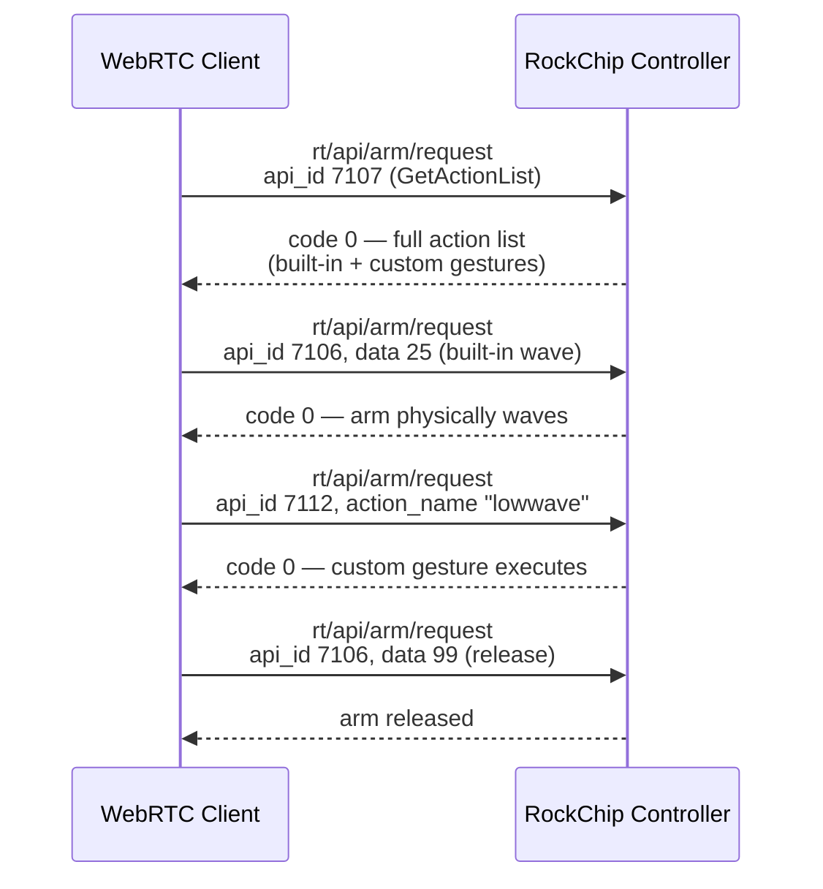

## Symptom

Every reasonable guess at the WebRTC topic for arm/gesture control on the G1 EDU returns an error. `rt/api/sport/request` returns code `3203` (API not implemented). `rt/api/loco/request` and `rt/api/arm_action/request` both return `{'type': 'err', 'info': 'Invalid Topic.xx'}`. Nothing in Unitree's public documentation names the correct topic for this specific robot.

## Environment

- Unitree G1 EDU, firmware 1.4.5
- `unitree_webrtc_connect` (community library, maintained by [legion1581](https://github.com/legion1581/unitree_webrtc_connect))
- LocalSTA connection to the RockChip motion controller (`192.168.123.161`)

## Root Cause

The correct topic simply isn't documented for G1 at the time of this investigation — Unitree's docs and the library's own README (which listed G1 firmware 1.4.0 as the latest tested version) didn't cover it. The only way to find it was systematic guessing against plausible topic names, informed by what's documented for other Unitree platforms in the same product family.

## What actually works



**The correct topic is `rt/api/arm/request`**, with responses on `rt/api/arm/response`. Three distinct `api_id` values matter:

- **`7107` — `GetActionList`**, undocumented for this purpose but genuinely useful: returns *both* built-in gestures and any custom gestures recorded via the Unitree app's training mode, as two separate lists in the response payload.
- **`7106` — built-in gesture execution**, documented, takes a numeric `data` field (e.g. `25` for a built-in wave). `data: 99` releases the arm afterward — worth calling after every gesture.
- **`7112` — custom gesture execution by name**, entirely undocumented at the time this was found. Takes an `action_name` string matching an entry from the custom-gestures list returned by `7107`. This was the genuinely missing piece: the official DDS SDK (`G1ArmActionClient`) only exposes `ExecuteAction(int_id)` for built-in gestures — there's no DDS path to trigger a custom, app-recorded gesture by name at all. Attempting to call `7112` directly over DDS returns error `7403` (private endpoint, not accessible on the public DDS path) — WebRTC is the only route to it.

```python
ARM_TOPIC = "rt/api/arm/request"

# Execute custom gesture by name (undocumented — the missing piece)
ps.publish_without_callback(
    topic=ARM_TOPIC,
    data={
        "header": {"identity": {"id": 1, "api_id": 7112}},
        "parameter": '{"action_name": "lowwave"}'
    },
    msg_type=DATA_CHANNEL_TYPE["REQUEST"]
)
# Returns: code=0 — gesture executes
```

## Why this matters beyond just "here's the right topic"

This closed a real capability gap: without it, custom gestures recorded through the Unitree app's own training mode — the natural, non-technical way to author new character motions — had no programmatic trigger path at all. The official SDK's built-in-only `ExecuteAction()` made custom, app-authored gestures a dead end for anything automated. This is what made programmatic dispatch of app-recorded gestures possible in the first place.

## Where this was documented for the community

Shared as [issue #53](https://github.com/legion1581/unitree_webrtc_connect/issues/53) on the `unitree_webrtc_connect` repo — worth checking that thread directly if you're working with G1 gesture control, since it also covers several adjacent findings from the same investigation (sport/locomotion command behavior, WebRTC audio track limitations, FSM-transition timing) that are documented as their own entries elsewhere in this log.

## Time cost

A focused investigation session — the topic itself was found through systematic testing of plausible names rather than trial-and-error over a long period, once the decision was made to test rather than keep searching for documentation that didn't exist.
